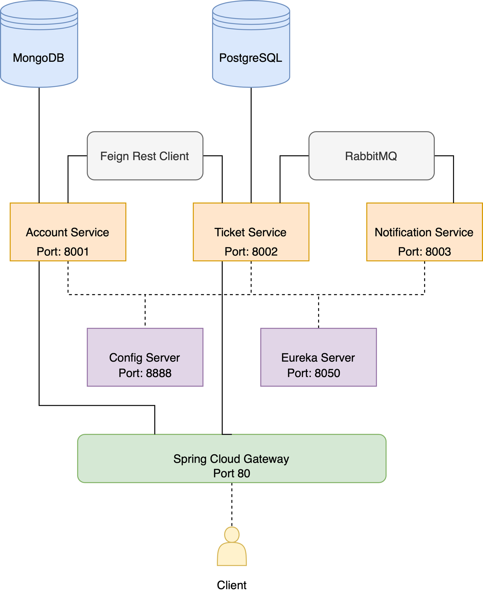

<head>
  <meta charset="UTF-8">
  <meta http-equiv="X-UA-Compatible" content="IE=edge">
  <meta name="viewport" content="width=device-width, initial-scale=1.0">
  <title>README</title>
  
  <link href="https://cdn.jsdelivr.net/npm/bootstrap@5.1.3/dist/css/bootstrap.min.css" rel="stylesheet"
    integrity="sha384-1BmE4kWBq78iYhFldvKuhfTAU6auU8tT94WrHftjDbrCEXSU1oBoqyl2QvZ6jIW3" crossorigin="anonymous">
</head>

<body>
  <h2>TICKET SYSTEM MICROSERVICE</h2>
  

  <ul>
    <li class="badge cli"></li>
    <li class="badge cli"></li>
    <li class="badge cli"></li>
  </ul>
  <h3>Abstract</h3>
  

    It is aimed to realize a ticket sales system that includes user information. Accordingly, it has been realized that
    a user who can register to the system with information such as e-mail, name, surname, password can then buy a ticket
    from the ticket sales system. The user who wants to buy a ticket must have a number record in the system. If there
    is no registration, our services will notify the user of an error. The ticket information is transmitted to the
    e-mail system of the user who successfully registered.
  

   
  

    
    
<b>img i. </b> Microservice Architecture

  

  <h4>Frameworks & Languages</h4>
  <ul>
    <li>Java</li>
    <li>Spring Boot</li>
    <li>PostgreSql</li>
    <li>MongoDB</li>
    <li>RabbitMQ</li>
    <li>Spring Cloud Gateway</li>

  </ul>
  <h3>Services</h4>
    <ol>
      <li>
        <h5>Account Service</h5>
        The port of this service is 8001. It performs user registration. It also performs rest communication with
        ticket-service over feign client. It is connected to the MongoDB database. The user can register to the system
        with fields such as full name, e-mail, password, year of birth. Creation date and id fields are generated
        automatically. The documentation for this service is as follows.
        <ul>
          <li>  http://localhost:8002/account/findAll</li>
          <li> http://localhost:8002/account/:userid</li>
          <li> http://localhost:8002/account/</li>
          <li> http://localhost:8002/account/:userid</li>
          <li> http://localhost:8002/account/:userid</li>

        </ul>
      </li>

       
      <li>
        <h5>Ticket Service</h5>
        The port of this service is 8002. This service is responsible for the ticket transactions of the users. It
        records the tickets with the PostgreSQL database. Database fields are id, description, notes, accountId,
        priorityType, statusType.
        Before saving the ticket, it makes a user query to the account-service with the feign client. It also performs
        this operation with REST communication. When the registration is successful, it sends a message to the
        notification-service with RabbitMQ. Its documentation is as follows.
        <ul>
          <li>  http://localhost:8002/ticket/findAll</li>
          <li> http://localhost:8002/ticket/:userid</li>
          <li> http://localhost:8002/ticket/</li>
          <li> http://localhost:8002/ticket/:userid</li>
          <li> http://localhost:8002/ticket/:userid</li>

        </ul>
      </li>
      
       

      <li>
        <h5>Notification Service</h5>
        Service port 8003. The purpose of this service is to send notifications to users. Receives message from
        ticket-service with RabbitMQ. It sends the content of this message to the user's e-mail address.
      </li>
    </ol>

</body>

